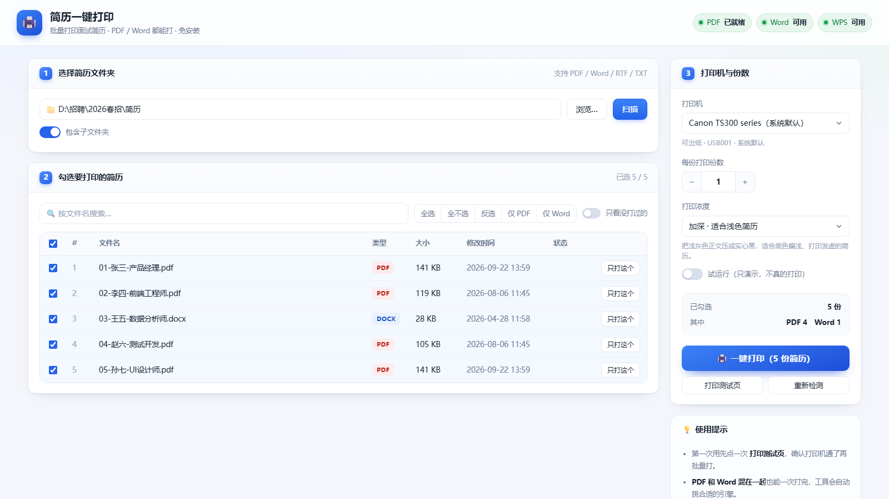

# 简历一键打印 · resume-batch-print

给"一堆人来面试"准备的**批量简历打印小工具**。
把当天收到的简历丢进一个文件夹，双击打开，勾选候选人，点一下 **一键打印**，全部按顺序送进打印机。

**PDF 和 Word 都能打。** 免安装、免联网（首次下载一次引擎）、不需要 Python / Node，
**整个文件夹拷到任何 Windows 电脑上都能直接用**。

[](https://github.com/bobo8886/resume-batch-print/actions/workflows/ci.yml)
[](LICENSE)
[](#环境要求)
[](#环境要求)


---

## 它解决什么问题

面试季一天来十几个人，简历散在一个文件夹里，一份份右键→打印→选打印机→确定，很容易漏打、重复打、顺序乱。
这个工具把这件事变成：**选文件夹 → 点一下 → 打完**。

顺带解决几个特别常见的坑：

| 坑 | 本工具的做法 |
|---|---|
| 一份简历十几页，**只想打某几页** | 「选页」按钮：点页码挑，或直接填 `1-3,5`，还能一键套用到整批 |
| 打出来**字很淡**、发虚 | 「打印浓度」自动识别图片版简历并加深正文，黑度提升约 3 倍 |
| 选到了 **Microsoft Print to PDF / OneNote** 这类虚拟打印机，任务被吞掉还显示成功 | 自动识别真假打印机、优先选真能出纸的、选错会警告并拦截 |
| 电脑上 **Word 是残缺版/未激活**，docx 打不了 | 自动降级到 WPS，再不行转 PDF 打印 |
| 工具放在**中文路径**下，PDF 引擎罢工 | 自动把引擎搬到纯英文目录再调用 |
| 不知道哪份打过了 | 打印记录 + 「只看没打过的」 |
| 面试官人多，每份要打好几份 | 一份设置，整批生效 |

---

## 快速开始

### 方式一：下载完整包（推荐给不折腾的用户）

到 [Releases](../../releases) 下载最新的 `resume-batch-print-vX.Y.Z.zip`，
解压到任意目录，**双击 `一键打印简历.bat`** 即可。包里已经带好了 PDF 引擎，无需联网。

### 方式二：克隆源码（仓库里不含二进制，首次会自动下载引擎）

```powershell
git clone https://github.com/bobo8886/resume-batch-print.git
cd resume-batch-print
```

然后**双击 `一键打印简历.bat`**。
第一次打开时页面顶部会提示缺少 PDF 引擎，点一下「**下载 PDF 引擎**」按钮，
工具会从 SumatraPDF 官方站点下载（约 8 MB）并**校验 SHA-256**，之后就一直离线可用。

> 也可以在 PowerShell 里跑：`powershell -NoProfile -ExecutionPolicy Bypass -File .\server.ps1`

### 用起来

1. **双击** `一键打印简历.bat` —— 弹出黑窗口 + 自动打开浏览器界面
   （黑窗口就是程序本体，**关掉它就等于退出工具**）
2. **① 选择简历文件夹** → 「浏览…」或直接粘贴路径 → 「扫描」
3. **② 勾选要打印的简历**（默认全选）
4. **③ 打印机与份数** → 点 **「🖨️ 一键打印」**

> 第一次用建议先点一次 **「打印测试页」**，确认打印机通路正常再批量打。

---

## 只打某几页（选页打印）

一份简历十几页，但你只想给面试官看其中两页？点那一行右边的 **「选页」**：


- **点页码**加选 / 取消（打开时默认全选，点一下就取消那一页）
- 也可以直接**填页码范围**：`1-3,5`、`odd`（奇数页）、`even`（偶数页）、`last`（最后一页）
- 快捷按钮：**全部页 / 只看第 1 页 / 奇数页 / 偶数页 / 全不选**
- 勾上 **「套用到其它已勾选的简历」**，一次给整批简历设好页码
- 设过页码的行会在「页数 / 选页」列显示成蓝色标签，一眼看得见
- 想全部恢复：工具栏的 **「清除所有选页」**

> 页码超范围会被明确拒绝（比如文件只有 5 页却填了 9）；
> 批量套用时则会**自动裁掉越界页**（「都打 1-3 页」遇到只有 2 页的简历不会失败）。
> 两种模式下 `server.ps1` 与前端用的是同一套解析规则，行为一致。

---

## 打印浓度（解决"字很淡"）

很多简历 PDF 其实是**手机拍的 / 扫描导出的图片版**，正文是浅灰色，直接打印就会发虚发淡。
侧栏的「打印浓度」就是治这个的：



| 选项 | 作用 |
|---|---|
| **自动（推荐）** | 自动识别：图片版/扫描件 → 加深；纯文字版 → 原样打印 |
| **标准** | 完全原样，不做任何处理 |
| **加深** | 把浅灰正文压成实心黑 |
| **强力加深** | 更狠，适合整份都很淡的扫描件 |

实测同一份浅灰简历，**送进打印机的位图里实心黑像素占比从 3.3% 提升到 9.3%**（强力加深 10.4%）。

> 只对 PDF 生效，需要 Windows 10 及以上；更老的系统会自动退回原样打印。
> 「加深」和「选页」可以叠加使用，两边都生效。

---

## 支持的格式与打印通道

| 你的简历 | 用什么打 | 弹窗 |
|---|---|---|
| `.pdf` | 随包的 **SumatraPDF**（所见即所得） | 完全静默 |
| `.doc` `.docx` `.rtf` `.txt` `.odt` `.wps` | 本机 **Microsoft Word** | 完全静默 |
| 同上，但本机没 Word / Word 坏了 | 自动改用 **WPS** | 完全静默 |
| 同上，Word 和 WPS 都打不了 | 自动**转成 PDF 再静默打印** | 完全静默 |

页面上方的三个状态灯实时显示本机 `PDF / Word / WPS` 的可用情况，
旁边有「重新检测」按钮（换电脑、装完 Office 之后点一下）。

---

## 环境要求

- **Windows 7 及以上**（自带 Windows PowerShell 5.1）
- 打印 `.docx` 需要本机装有 **Microsoft Word** 或 **WPS**（二选一即可）
- 「打印浓度 / 加深」需要 **Windows 10 及以上**（用的是系统自带的 `Windows.Data.Pdf`）
- 不需要 Python、Node.js、也不需要管理员权限

---

## 常见问题

**Q：点了打印没反应 / 打印机不动？**
先看右侧「打印机」下面那行字。**虚拟打印机是不会出纸的**（`Microsoft Print to PDF`、`OneNote`、
`导出为 WPS PDF`），任务会被直接丢掉。工具会自动优先选中真能出纸的那台，选错也会亮警告条。

**Q：黑窗口一闪就没了？**
可能是被杀软拦了。在该目录手动执行看报错：
```
powershell -NoProfile -ExecutionPolicy Bypass -File server.ps1
```

**Q：浏览器没自动打开？**
黑窗口里会打印网址（形如 `http://127.0.0.1:17890/`），手动复制到浏览器即可。

**Q：「浏览文件夹」没有弹系统对话框？**
那是**网页内置**的浏览器，不会躲到浏览器后面去、也不会把服务卡死。
支持面包屑、上一级、桌面/文档/下载快捷入口，也可以直接粘贴路径。

**Q：能打印图片、Excel 吗？**
目前只认 PDF 和 Word 系文档。

更多问题见 [使用说明.md](使用说明.md)。

### 网络问题：`git clone` / `git push` 卡住或被重置

在国内访问 `github.com` 的 git 通道经常被重置（报 `Connection was reset` /
`Recv failure`），但 `api.github.com` 通常是通的。加这一行往往就能解决：

```powershell
git config --global http.version HTTP/1.1
```

如果还是不行，给 git 挂个代理：

```powershell
git config --global http.proxy http://127.0.0.1:7890   # 端口改成你自己的
git config --global https.proxy http://127.0.0.1:7890
```

只想下载来用的话，直接去 [Releases](../../releases) 拿完整包最省事（不用 clone）。

---

## 安全

- 服务**只监听 `127.0.0.1`**，局域网内其它机器访问不到，也不会把简历上传到任何地方（没有任何联网上报）
- 有 **Host / Origin / 方法闸门 / Content-Type** 四重校验，防御 DNS 重绑定与 CSRF：
  所有会改变状态的接口**一律要求 POST**（非 POST 返回 405），只有只读的 `/api/info` 允许 GET
- 只有**本次扫描列出过**的文件才允许打印
- 打印机名做**精确成员测试**，通配符之类的值进不来
- 打开 Word/WPS 文档前会**显式关闭全部宏**、关闭链接更新
- 引擎下载会**校验 SHA-256**，不匹配直接拒绝安装；打包脚本也会校验引擎与源码里的固定值一致
- 运行时会在 `config.json` 和 `打印记录\` 留下本机信息，这两项已被 `.gitignore` 排除

> 2026-10 做过一次完整安全审计（4 侦察 + 4 猎手 + 7 独立验证 + 1 覆盖评审）。
> 审计发现的全部问题——3 条需要外部事实定论的线索、7 个未覆盖边界、以及若干加固项——
> 都在 **v1.2.0** 里修掉了，逐条对应见 [CHANGELOG.md](CHANGELOG.md)。

详见 [SECURITY.md](SECURITY.md)。发现问题请走私密安全公告，别开公开 issue。

---

## 许可证

本项目源码以 **MIT** 许可证发布，见 [LICENSE](LICENSE)。

工具会调用第三方组件 **SumatraPDF（GPLv3）**，本仓库**不包含其二进制**，
由工具在首次使用时按需下载并校验哈希。详见 [THIRD-PARTY.md](THIRD-PARTY.md)。

---

## 贡献

欢迎提 Issue 和 PR。动手前请看一眼 [CONTRIBUTING.md](CONTRIBUTING.md) —— 里面记录了
几个"改代码时千万别踩回去"的坑（中文路径、Office PIA、SumatraPDF 栅格化等）。
