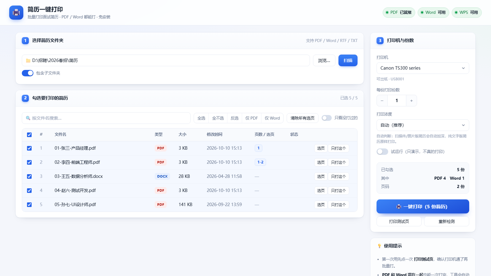
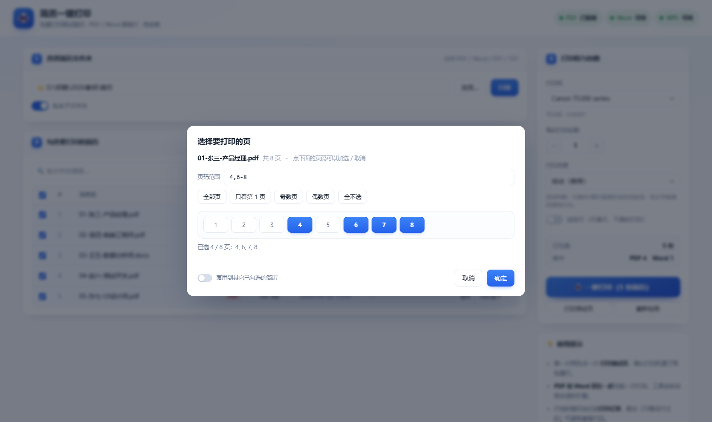

# 简历一键打印

给"一堆人来面试"准备的批量打印小工具：把当天收到的简历丢进一个文件夹，
双击打开，勾选候选人，点一下 **一键打印**，全部按顺序送进打印机。

**PDF 和 Word 都能打。** 免安装、免联网、不需要 Python/Node，
**整个文件夹拷到任何 Windows 电脑上都能直接用**。



---

## 一、怎么用（三步）

1. **双击**「`一键打印简历.bat`」
   —— 会弹出一个黑色小窗口，并自动打开浏览器里的操作界面。
   （黑窗口就是程序本体，**用完关掉黑窗口就等于退出工具**。）

2. **① 选择简历文件夹** —— 点「浏览…」选文件夹，或直接把路径粘贴进输入框按回车，然后点「扫描」。
   左侧会列出所有简历，默认**全部勾选**。

3. **② 勾选要打印的简历**，然后在右侧 **③ 打印机与份数** 里选好打印机、份数，
   点 **「🖨️ 一键打印」** —— 界面会实时显示每一份的进度、用的哪个引擎、成功还是失败。

> 第一次用建议先点一次 **「打印测试页」**，确认打印机通路正常，再批量打。

---

## ⚠️ 打不出来？先看打印机选对没有

这是最容易踩的坑：**虚拟打印机是不会出纸的。**

`Microsoft Print to PDF`、`OneNote`、`导出为 WPS PDF` 这类都是"虚拟打印机"，
任务发过去会被**直接丢掉**，机器一点动静都没有，而工具这边还显示 ✔。

本工具会帮你避开：

- 打印机下拉框下面那行会明确写出这台机器 **可出纸** 还是 **虚拟打印机**；
- 打开工具时**自动优先选中真能出纸的那台**（比如 USB 接的 Canon / HP），而不是系统默认；
- 万一你手动选了虚拟打印机，侧栏会出现橙色警告条，点「一键打印」时还会再拦你一次问要不要换。

**所以如果你点了打印没反应 —— 先看右侧「打印机」下面那行字。**

---

## 二、支持的格式与打印方式

| 你的简历 | 用什么打 | 弹窗 |
|---|---|---|
| `.pdf` | 随包的 **SumatraPDF**（所见即所得，排版不会变） | 完全静默 |
| `.doc` `.docx` `.rtf` `.txt` `.odt` `.wps` | 本机 **Microsoft Word** | 完全静默 |
| 同上，但本机没 Word / Word 坏了 | 自动改用本机 **WPS** | 完全静默 |
| 同上，Word 和 WPS 都打不了 | 自动**转成 PDF 再静默打印** | 完全静默 |

也就是说：**Word 打不了会自动降级，不会一次失败就整批停掉。**
顶部三个状态灯实时显示本机 `PDF / Word / WPS` 到底能不能用，
旁边有 **「重新检测」** 按钮可以随时重测（换电脑、装完 Office 之后点一下）。

---

## ⭐ 打印出来字很淡？用「打印浓度」

很多简历 PDF 其实是**手机拍的、或者扫描/导出的图片版**——正文是浅灰色，
直接打印就会发虚发淡，细笔画糊成一片。

侧栏的 **「打印浓度」** 就是治这个的：

| 选项 | 作用 | 什么时候用 |
|---|---|---|
| **自动（推荐）** | 自动识别：图片版/扫描件简历 → 加深；纯文字版简历 → 原样打印 | 默认就用这个 |
| **标准** | 完全原样，不做任何处理 | 想跟别的阅读器打印结果一致时 |
| **加深** | 把浅灰正文压成实心黑（gamma 1.8） | 打印发虚、字发灰 |
| **强力加深** | 更狠的加深（gamma 2.6） | 整份都很淡的扫描件/照片版 |

实测同一份浅灰简历，送进打印机的位图里**实心黑像素占比从 3.3% 提升到 9.3%**
（强力加深到 10.4%），字明显变实。

> 加深只对 **PDF** 生效。Word 文档由 Word 自己排版打印，不走这条通道。
> 需要 Windows 10 及以上；更老的系统会自动退回原样打印，不会报错。

---

## 三、拷到别的电脑上用

把 **`简历一键打印`** 这整个文件夹（或直接拷 `简历一键打印.zip`）复制到 U 盘或目标电脑，
双击 `一键打印简历.bat` 即可。要求只有一条：**目标电脑是 Windows 7 及以上**（自带 PowerShell）。

不需要在新电脑上安装任何东西。`bin\SumatraPDF.exe` 是随工具一起走的便携版 PDF 打印引擎；如果是从源码 clone 的（仓库里不含它），首次打开时点一下页面上的「下载 PDF 引擎」即可。

> 拷过去之后建议点一次 **「重新检测」**，让工具重新确认那台电脑上 Word/WPS 的可用情况。

---

## 四、界面上的几个开关

- **包含子文件夹**：勾上就会连子目录里的简历一起扫描。
- **按文件名搜索**、**只看没打过的**：人多的时候用来快速定位。
- **全选 / 全不选 / 反选 / 仅 PDF / 仅 Word**：快速批量勾选。
- **份数**：每份简历打几份（比如 3 个面试官就设 3）。
- **打印浓度**：见上面「打印出来字很淡？」那一节，默认 **自动** 就够用。
- **试运行**：只演示"会打哪些、用什么引擎打"，**不真的送打印机**。第一次用强烈建议先试运行一次。
- **只打这个**：某一行右边的按钮，单独打印这一份。
- **选页**：见下面「只想打其中几页」那一节。

---

## 四之二、只想打其中几页（选页打印）

一份简历十几页，但你只想给面试官看其中两页 —— 点那一行右边的 **「选页」**：



- **点页码**加选 / 取消。打开时默认是"全选"，点一下就是取消那一页。
- 也可以**直接填页码**，支持这几种写法（逗号分隔，混着写也行）：

  | 写法 | 意思 |
  |---|---|
  | `3` | 只打第 3 页 |
  | `1-3` | 第 1 到 3 页（写成 `3-1` 也一样，会自动理顺） |
  | `1-3,5,8` | 混着写 |
  | `odd` / `even` | 奇数页 / 偶数页 |
  | `last` 或 `-1` | 最后一页 |

- 快捷按钮：**全部页 / 只看第 1 页 / 奇数页 / 偶数页 / 全不选**。
- 勾上 **「套用到其它已勾选的简历」**，可以一次给整批简历设好同一套页码
  （比如"这 20 份简历都只打第 1 页"）。
- 设过页码的行，会在「页数 / 选页」列显示成蓝色标签；侧栏还会显示"几份已指定页码"。
- 想全部恢复成打所有页：点工具栏的 **「清除所有选页」**。

**两种校验方式（重要）**：

- 你自己在「选页」里填的页码，**超范围会直接报错** ——
  比如文件只有 5 页却填了 9，会提示"第 9 页超出范围（这份文件共 5 页）"。
- 用「套用到其它已勾选的简历」批量设时，则会**自动裁掉越界页** ——
  "都打 1-3 页"遇到一份只有 2 页的简历，它会自动只打 1-2 页，不会让整份失败。

> 「选页」和「打印浓度」可以叠加：既加深、又只打选中的那几页。
> 「加深」通道是自己重建 PDF，选页是在重建时一并完成的，两者结果一致。

---

## 五、打印记录

- 每次打印成功都会记到 `打印记录\printed.json`，列表里显示为「打过」。
- 配合 **「只看没打过的」**，可以避免重复打印。
- 想清空记录：删掉 `打印记录\printed.json` 即可。
- 界面里的「打开打印记录」按钮可以直接打开这个目录。

---

## 六、常见问题

**Q：黑窗口一闪就没了？**
说明 PowerShell 被系统策略拦了。检查是否被杀软拦截；
或在黑窗口里手动执行下面这行看具体报错：
```
powershell -NoProfile -ExecutionPolicy Bypass -File server.ps1
```

**Q：浏览器没自动打开？**
黑窗口里有网址（形如 `http://127.0.0.1:17890/`），手动复制到浏览器打开即可。

**Q：提示端口被占用？**
程序会自动往后找可用端口，看黑窗口里显示的实际网址。

**Q：点了打印没反应 / 打印机不动？**
按顺序排查：
1. **看右侧「打印机」下面那行字和橙色警告条** —— 选中虚拟打印机就换一台真打印机；
2. 点「打印测试页」，看打印机有没有出纸；
3. 检查打印机是不是脱机、缺纸、暂停、墨盒空了；
4. 换一台打印机再试。

**Q：Word 简历打不了，提示「Word 组件没有就绪」？**
那台电脑的 Office 可能是未激活/装残缺了（这时顶部 Word 灯会是红的）。
两个办法：点「重新检测」确认一下；或者干脆不管 —— 工具会自动改用 WPS，
再不行会自动转成 PDF 打印，**PDF 简历更是完全不受影响**。

**Q：文件夹浏览窗口好用吗？会不会卡住？**
点「浏览…」打开的是**网页内置**的浏览器（不是 Windows 系统对话框），
所以它永远显示在浏览器里，不会躲到后面去，也不会把服务卡死。
支持面包屑导航、「上一级」、桌面/文档/下载快捷入口、直接粘贴路径。

**Q：打印 Word 时我的默认打印机被改了？**
不会。本工具是通过 Office 的 `ActivePrinter` 属性指定目标打印机，**不碰你的系统默认打印机**。
（如果发现默认打印机变了，那是 Windows 10/11 自带的"让 Windows 管理默认打印机"干的。）

**Q：能打印别的文件（图片、Excel）吗？**
当前只认 PDF 和 Word 系文档。需要再加格式告诉我。

---

## 七、文件夹结构

```
resume-batch-print\          ← 仓库目录（解压出来的完整包也是这个结构）
├─ 一键打印简历.bat            ← 双击这个
├─ server.ps1                  ← 本地打印服务（打印逻辑都在这）
├─ bin\
│   ├─ SumatraPDF.exe          ← 便携版 PDF 静默打印引擎（仓库里不含，首次自动下载）
│   └─ SumatraPDF-settings.txt
├─ web\
│   ├─ index.html              ← 操作界面
│   ├─ app.js
│   └─ style.css
├─ docs\                       ← 截图（仓库用）
├─ tests\                      ← 自动化测试
├─ tools\                      ← 打包 / 静态分析配置
├─ 打印记录\                   ← 打印记录与测试页（自动生成）
├─ config.json                 ← 上次用的文件夹/打印机/份数（自动生成）
├─ 使用说明.md
├─ README.md / LICENSE / SECURITY.md / THIRD-PARTY.md / CHANGELOG.md
└─ 本包说明.txt                 ← 仅完整包里有（第三方组件声明）
```

> `server.ps1` 只监听本机回环地址 `127.0.0.1`，不对外开放，也不会把简历上传到任何地方。

---

## 八、给想改代码的人

两个踩过的坑，改的时候别踩回去：

1. **SumatraPDF 的程序路径不能含中文**。只要它自己所在的路径有中文，打印就会报
   `StartDoc() failed`（简历文件路径有中文没关系）。所以工具启动时会自动把它复制到
   `%PUBLIC%\ResumePrintEngine\` 这类纯英文目录再调用。

2. **Office 的自动化不能走 PowerShell 原生写法**（`$word.Documents`）。
   很多电脑上 Office 互操作程序集（PIA）是坏的或没装，这时对象能创建但属性全返回 `null`。
   本工具用了一段内嵌的 C#（`server.ps1` 里的 `Disp` 类）直接走 `IDispatch::Invoke`，
   完全绕开 PIA，并且对 `RPC_E_CALL_REJECTED`（目标程序忙）自动重试。
   Word 和 WPS 用的是同一套代码，只是 ProgID 不同。

3. 所有 `.ps1` 文件必须存成 **UTF-8 with BOM**，否则 Windows PowerShell 5.1 会把中文读成乱码
   甚至解析失败。

4. **PDF「加深」通道**：用 WinRT 的 `Windows.Data.Pdf` 把每页渲染成位图（注意
   `PdfPage.Size` 单位是 DIP，要 ×0.75 才是 pt），按 gamma 查表加深，再用自带的
   极简 PDF 写入器（zlib/FlateDecode）拼成新 PDF，最后交给 SumatraPDF 打印。
   直接走 GDI+ 的 `PrintDocument` 在这台机器上会"报告成功但不产出"，所以没采用。
